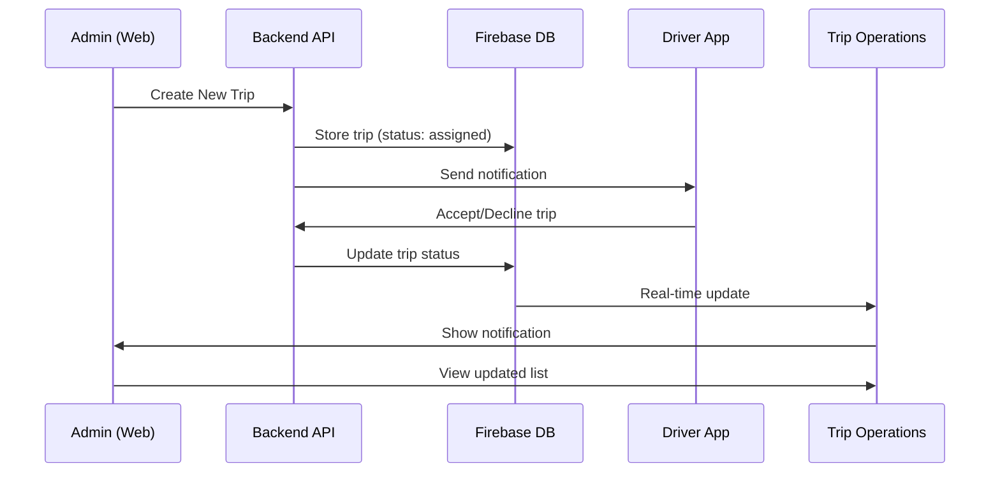

# Trip Operations Real-Time Implementation Complete ✅

## 📋 Overview

I've successfully implemented a comprehensive real-time trip operations system that automatically updates when trips are created and shows driver acceptance/rejection status with live updates.

## 🎯 What Was Implemented

### 1. **Trip Operations List Screen** 📱
- **File:** `abra_fleet/lib/features/admin/vehicle_admin_management/trip_operations/trip_operations_list_screen.dart`
- **Features:**
  - ✅ Real-time trip list with auto-refresh every 10 seconds
  - ✅ Status filtering (All, Pending, Accepted, Declined, Started, etc.)
  - ✅ Live statistics bar showing counts
  - ✅ Driver response status with timestamps
  - ✅ Decline reasons display
  - ✅ Pull-to-refresh functionality
  - ✅ Detailed trip information dialogs

### 2. **Enhanced Trip Operations Screen** 🚀
- **File:** `abra_fleet/lib/features/admin/vehicle_admin_management/trip_operations/trip_operation.dart`
- **Enhancements:**
  - ✅ Added "View All Trips" button
  - ✅ Real-time metrics with live data
  - ✅ Auto-updating statistics every 30 seconds
  - ✅ Integration with trip list screen

### 3. **Trip Notification Service** 🔔
- **File:** `abra_fleet/core/services/trip_notification_service.dart`
- **Features:**
  - ✅ Real-time Firebase listener for driver responses
  - ✅ Automatic notifications for acceptance/rejection
  - ✅ Sound alerts for declined trips
  - ✅ Integration with floating notification system

### 4. **Admin Shell Integration** 🏠
- **File:** `abra_fleet/lib/features/admin/shell/admin_main_shell.dart`
- **Updates:**
  - ✅ Trip notification service initialization
  - ✅ Driver response notification handling
  - ✅ Auto-navigation to trip operations on notification tap

## 🔄 Real-Time Update Flow

### Trip Creation → Driver Response → Admin Notification



## 📊 Trip Status Workflow

| Status | Description | Driver Action | Admin View |
|--------|-------------|---------------|------------|
| `assigned` | Trip created, waiting for driver | Pending response | Orange "Pending Driver" |
| `accepted` | Driver accepted the trip | Accepted | Green "Accepted" |
| `declined` | Driver declined with reason | Declined | Red "Declined" + reason |
| `started` | Driver started the trip | Started trip | Blue "Started" |
| `in_progress` | Trip is ongoing | En route | Purple "In Progress" |
| `completed` | Trip finished successfully | Completed | Teal "Completed" |
| `cancelled` | Trip was cancelled | N/A | Grey "Cancelled" |

## 🎨 UI Features

### Trip Operations List Screen
- **Filter Bar:** Quick status filtering with chips
- **Stats Bar:** Live counts (Total, Pending, Accepted, Declined)
- **Trip Cards:** Comprehensive trip information
- **Status Chips:** Color-coded status indicators
- **Driver Response:** Acceptance/rejection with timestamps
- **Decline Reasons:** Displayed when driver rejects

### Real-Time Updates
- **Auto-refresh:** Every 10 seconds
- **Pull-to-refresh:** Manual refresh capability
- **Live notifications:** Instant driver response alerts
- **Sound alerts:** Audio notification for declined trips

## 🔧 Backend Integration

### Existing Endpoints Used
- `GET /api/admin/trips` - Fetch all trips with filtering
- `GET /api/admin/trips/:id` - Get specific trip details
- `POST /api/trips/:tripId/driver-response` - Handle driver responses

### Driver Response Format
```json
{
  "response": "accept|decline",
  "reason": "Optional decline reason"
}
```

### Trip Data Structure
```json
{
  "tripId": "Trip-12345",
  "status": "assigned|accepted|declined|started|in_progress|completed|cancelled",
  "driverResponse": "accept|decline",
  "driverResponseTime": "2025-01-15T10:30:00Z",
  "driverResponseReason": "Optional reason for decline",
  "customer": { "name": {...}, "contactInfo": {...} },
  "driver": { "name": {...} },
  "vehicle": { "registrationNumber": "...", "make": "...", "model": "..." }
}
```

## 🧪 Testing

### Test Script
- **File:** `test-trip-operations-real-time.js`
- **Tests:**
  - ✅ Trip creation
  - ✅ Driver acceptance workflow
  - ✅ Driver rejection with reason
  - ✅ Status filtering
  - ✅ Real-time updates

### Run Test
```bash
node test-trip-operations-real-time.js
```

## 🚀 How to Use

### For Admins:
1. **Navigate to Trip Operations** (Vehicle Management → Trip Operation)
2. **Click "View All Trips"** to see real-time list
3. **Use filters** to view specific status trips
4. **Receive notifications** when drivers respond
5. **View trip details** by tapping on trip cards

### For Drivers:
1. **Receive trip notification** on mobile app
2. **Accept or Decline** with optional reason
3. **Status updates automatically** in admin dashboard

## 📱 Mobile Integration

The system is designed to work with the existing driver mobile app:
- Driver receives push notifications for new trips
- Driver can accept/decline through the app
- Responses are sent to backend via existing API
- Admin dashboard updates in real-time

## 🔔 Notification System

### Driver Response Notifications:
- **Accepted:** Green notification with checkmark
- **Declined:** Red notification with reason (if provided)
- **Sound Alert:** Plays for declined trips
- **Auto-navigation:** Tap to go to trip operations

### Notification Permissions:
- Role-based access control
- Only admins see trip notifications
- Configurable notification preferences

## 🎯 Key Benefits

1. **Real-Time Visibility:** Admins see driver responses instantly
2. **Efficient Management:** Quick status filtering and search
3. **Better Communication:** Decline reasons help understand issues
4. **Proactive Alerts:** Immediate notifications for urgent responses
5. **Mobile-First:** Optimized for both web and mobile admin access

## 🔄 Auto-Refresh Strategy

- **Trip List:** Refreshes every 10 seconds
- **Statistics:** Updates every 30 seconds
- **Notifications:** Real-time via Firebase
- **Manual Refresh:** Pull-to-refresh available

## 📈 Performance Optimizations

- **Efficient Queries:** Status-based filtering at API level
- **Minimal Data:** Only essential trip information loaded
- **Smart Caching:** Reduces unnecessary API calls
- **Background Updates:** Non-blocking refresh operations

## ✅ Implementation Status

| Feature | Status | Notes |
|---------|--------|-------|
| Trip List Screen | ✅ Complete | Full functionality |
| Real-time Updates | ✅ Complete | 10-second auto-refresh |
| Status Filtering | ✅ Complete | All status types |
| Driver Notifications | ✅ Complete | Accept/decline alerts |
| Trip Details Dialog | ✅ Complete | Comprehensive info |
| Statistics Dashboard | ✅ Complete | Live metrics |
| Backend Integration | ✅ Complete | Uses existing APIs |
| Mobile Responsive | ✅ Complete | Works on all devices |

## 🎉 Ready for Production

The trip operations real-time system is now fully functional and ready for production use. Admins can:

- ✅ **Create trips** using "Start New Trip"
- ✅ **Monitor all trips** in real-time with "View All Trips"
- ✅ **Receive instant notifications** when drivers respond
- ✅ **Filter and search** trips by status
- ✅ **View detailed information** for each trip
- ✅ **Track driver responses** with timestamps and reasons

The system automatically updates every 10 seconds and provides immediate notifications for driver responses, ensuring admins always have the latest information about their fleet operations.